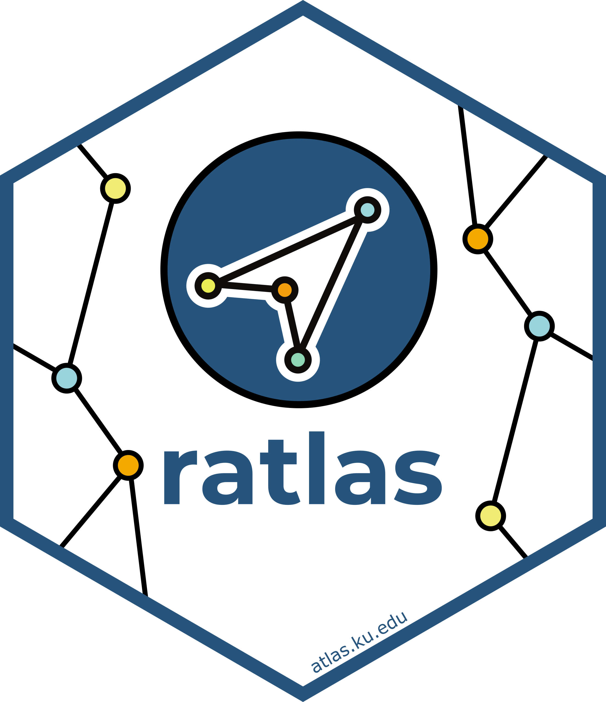

<!-- README.md is generated from README.Rmd. Please edit that file -->

```{r setup, include = FALSE}
knitr::opts_chunk$set(
  collapse = TRUE,
  comment = "#>",
  fig.path = "man/figures/README-",
  out.width = "100%"
)
```

# ratlas 

<!-- badges: start -->

[](https://github.com/atlas-aai/ratlas/actions) 
[](https://app.codecov.io/gh/atlas-aai/ratlas?branch=main)

<!-- badges: end -->

The goal of ratlas is to provide uniform [R Markdown](https://bookdown.org/yihui/rmarkdown/) templates for creating topic guides and technical reports, helper functions formatting text in documents, and providing consistent themes for [**ggplot2**](https://ggplot2.tidyverse.org) graphics.

## Installation

You can install the latest version with:

``` r
install.packages("atlas-aai/ratlas")
```

